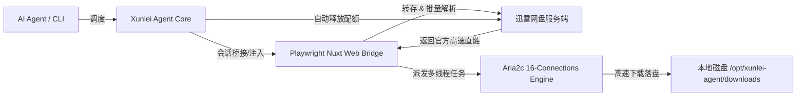

# Xunlei Cloud Drive (迅雷网盘) Linux Agent Skill

本技能为任何 AI Agent 模型（Claude / Cursor / Codex / Gemini / GPT 等）提供在 Linux 服务器环境下全自动操作迅雷网盘（Xunlei Cloud Drive）的标准流程、命令行规范、Python SDK 与 Function Calling 工具集成指南。

---

## 1. 核心架构与原理

针对数据中心与海外云服务器环境下的 IP 限制与 `x-captcha-token` 防护机制，本工具采用了**无头浏览器会话桥接 + 官方 CDN 高速直链提取 + 本地 Aria2 16线程并发下载**的工业级设计：



---

## 2. 环境依赖与安装

目标 Linux 服务器需预装：
- `python3 (>= 3.9)`, `pip3`, `aria2`
- `playwright` (Chromium 内核)

### 安装命令：
```bash
cd /opt/xunlei-agent
pip3 install -e . --break-system-packages
playwright install chromium
playwright install-deps chromium
```

---

## 3. 凭据与持久化会话

- **会话与 Cookie 存储路径**：`~/.config/xunlei/state.json`
- **Token 配置文件路径**：`~/.config/xunlei/config.json`
- 登录凭据在首次扫码/注入后自动持久化，支持 Bearer Token 自动续期。

---

## 4. 命令行 CLI 快速上手 (`xunlei-agent`)

Agent 可直接在终端中调用 `xunlei-agent` 执行操作，支持 `--json` 格式供大模型精准解析：

### 4.1 一键转存并高速下载分享链接（核心功能）
全自动执行：解析提取码 ➔ 转存至网盘 ➔ 提取高速直链 ➔ Aria2 16线程并发下载 ➔ 校验文件 ➔ 自动删除网盘临时文件。

```bash
# 基础转存并下载（自动清理网盘转存文件）
xunlei-agent fetch "https://pan.xunlei.com/s/xxxxxx" --pwd 提取码

# 指定本地下载存放目录
xunlei-agent fetch "https://pan.xunlei.com/s/xxxxxx" --pwd 提取码 --out /data/downloads

# 下载后保留网盘中的文件（不清理）
xunlei-agent fetch "https://pan.xunlei.com/s/xxxxxx" --pwd 提取码 --no-clean

# 结构化 JSON 机器输出（Agent 推荐）
xunlei-agent fetch "https://pan.xunlei.com/s/xxxxxx" --pwd 提取码 --json
```

### 4.2 查看网盘存储容量
```bash
xunlei-agent space --json
```
**JSON 输出示例**：
```json
{
  "total_bytes": 1110249046016,
  "used_bytes": 8505,
  "available_bytes": 1110249037511,
  "total_human": "1.01 TB",
  "used_human": "8.31 KB",
  "available_human": "1.01 TB"
}
```

### 4.3 查看网盘文件列表
```bash
# 列出根目录文件
xunlei-agent ls --json

# 列出指定目录
xunlei-agent ls <folder_id> --limit 50 --json
```

### 4.4 下载网盘指定文件（直接按 File ID 高速下载）
```bash
# 基础下载（按网盘原始文件名下载到默认目录）
xunlei-agent download <file_id>

# 自定义保存文件名与输出路径
xunlei-agent download <file_id> --name my_script.sh --out /data/downloads

# 结构化 JSON 输出
xunlei-agent download <file_id> --json
```

### 4.5 删除网盘文件与清空回收站
```bash
# 删除指定文件/文件夹
xunlei-agent rm <file_id_1> <file_id_2> --json

# 清空回收站释放空间
xunlei-agent empty-trash
```

### 4.6 输出 Agent 工具定义 (Schema)
```bash
xunlei-agent schema
```

---

## 5. Python SDK 与 Agent Function Calling 集成

AI Agent 可在 Python 代码中直接引用 SDK：

```python
from xunlei_agent.agent_tool import XunleiAgentTool

# 初始化工具实例
tool = XunleiAgentTool(default_download_dir="/opt/xunlei-agent/downloads")

# 1. 检查可用容量
space = tool.check_space()
print(f"剩余空间: {space['available_human']}")

# 2. 一键转存与下载
result = tool.fetch_and_download(
    share_url="https://pan.xunlei.com/s/VP-29fHm5-wvDyFjI-JRJ1V1A1",
    passcode="r32b",
    download_to="/opt/xunlei-agent/downloads",
    auto_clean_drive=True
)

for file_info in result["downloaded_files"]:
    print(f"文件: {file_info['name']}")
    print(f"大小: {file_info['size_human']}")
    print(f"SHA256: {file_info['sha256']}")
    print(f"本地路径: {file_info['path']}")
```

---

## 6. Function Calling JSON Schema (供 LLM 工具注册)

```json
[
  {
    "type": "function",
    "function": {
      "name": "xunlei_fetch_and_download",
      "description": "解析迅雷网盘分享链接，秒级转存并调用 Aria2 16线程高速下载到 Linux 本地磁盘路径，下载后可自动清理网盘空间。",
      "parameters": {
        "type": "object",
        "properties": {
          "share_url": {
            "type": "string",
            "description": "迅雷网盘分享链接 (例如 https://pan.xunlei.com/s/xxx 或 key)"
          },
          "passcode": {
            "type": "string",
            "description": "分享链接提取码 (若无则传空字符串)"
          },
          "download_to": {
            "type": "string",
            "description": "服务器本地目标下载目录路径，默认为 /opt/xunlei-agent/downloads"
          },
          "auto_clean_drive": {
            "type": "boolean",
            "description": "下载完成后是否自动删除网盘内的临时转存文件并清空回收站，默认为 true"
          }
        },
        "required": ["share_url"]
      }
    }
  },
  {
    "type": "function",
    "function": {
      "name": "xunlei_check_space",
      "description": "查询迅雷云盘的总空间、已用空间和剩余可用空间。",
      "parameters": {
        "type": "object",
        "properties": {}
      }
    }
  },
  {
    "type": "function",
    "function": {
      "name": "xunlei_list_files",
      "description": "列出迅雷网盘中的文件和文件夹列表。",
      "parameters": {
        "type": "object",
        "properties": {
          "parent_id": {
            "type": "string",
            "description": "目标文件夹ID，留空表示根目录"
          }
        }
      }
    }
  },
  {
    "type": "function",
    "function": {
      "name": "xunlei_delete_files",
      "description": "从迅雷网盘中删除指定的文件或文件夹以释放空间。",
      "parameters": {
        "type": "object",
        "properties": {
          "file_ids": {
            "type": "array",
            "items": {"type": "string"},
            "description": "要删除的文件或文件夹 ID 列表"
          }
        },
        "required": ["file_ids"]
      }
    }
  }
]
```

---

## 7. 常见问题与排错指南 (Agent Troubleshooting)

1. **`captcha_invalid` / `captcha_token is empty` 报错**：
   - 原因：迅雷对云服务器 IP 强校验 Web 端 `x-captcha-token`。
   - 方案：通过 `XunleiWebBridge`（Playwright 无头浏览器环境）驱动请求，页面会自动由 Captcha SDK 注入合法 Token，切勿脱离浏览器环境直接发起纯裸 HTTP POST 请求。
2. **下载速度受限或断流**：
   - 确保 `aria2c` 已安装并使用 `-x 16 -s 16` 参数，同时请求头需携带浏览器标准 `User-Agent`。
3. **会话过期**：
   - 运行 `xunlei-agent space` 会自动检测并尝试使用 `refresh_token` 续期。若续期失败，需重新启动扫码捕获流程。
