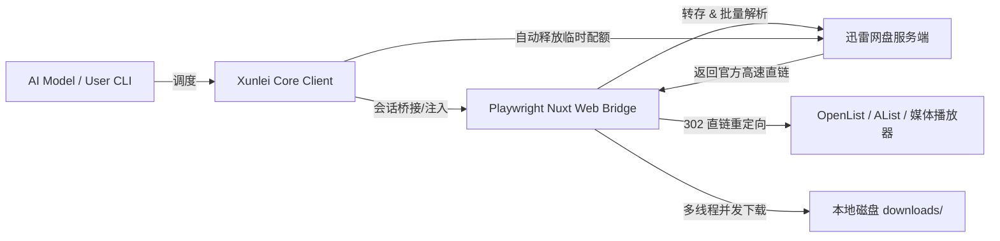

# Xunlei Pan (迅雷网盘) 模型 Skill 指南

本 Skill 为任何 AI 编程与自动化模型（Claude / Cursor / Codex / Gemini / GPT 等）提供在 Linux 与 Windows 环境下操作迅雷网盘的标准流程、命令行规范、WebDAV 挂载服务与 Function Calling 工具定义。

---

## 1. 核心架构与设计

针对网盘反爬与频繁失效的 `x-captcha-token` 防护机制，本工具采用**无头浏览器第一方会话注入 + 官方全国 CDN 高速直链提取 + Aria2 / 多线程 Range 分片下载 + WebDAV 302 重定向挂载**设计：



---

## 2. 环境依赖与安装

- `python3 (>= 3.9)`, `pip3`
- `playwright` (Chromium 内核)
- `aria2` (可选，缺失时自动切入原生 Python 多线程分片并发)

```bash
git clone https://github.com/kemomimi520/xunlei-agent.git
cd xunlei-agent
pip install -e .
playwright install chromium
```

---

## 3. 凭据与持久化会话

- **会话与 Cookie 存储路径**：`~/.config/xunlei/state.json`
- **Token 配置文件路径**：`~/.config/xunlei/config.json`
- 登录凭据在首次扫码/注入后自动持久化，支持 Bearer Token 自动续期。

---

## 4. 命令行使用指南 (`xunlei-agent`)

模型可直接在终端中调用 `xunlei-agent` 执行操作，推荐使用 `--json` 格式供大模型精准解析：

### 4.1 一键转存并高速下载分享链接（核心功能）
全自动执行：解析提取码 ➔ 转存至网盘 ➔ 提取高速直链 ➔ 并发下载 ➔ 校验文件 ➔ 仅自动清理本次转存产生的新文件。

```bash
# 基础转存并下载（自动清理网盘转存文件）
xunlei-agent fetch "https://pan.xunlei.com/s/xxxxxx" --pwd 提取码

# 指定本地下载存放目录
xunlei-agent fetch "https://pan.xunlei.com/s/xxxxxx" --pwd 提取码 --out /data/downloads

# 下载后保留网盘中的文件（不清理）
xunlei-agent fetch "https://pan.xunlei.com/s/xxxxxx" --pwd 提取码 --no-clean

# 结构化 JSON 机器输出（模型调用推荐）
xunlei-agent fetch "https://pan.xunlei.com/s/xxxxxx" --pwd 提取码 --json
```

### 4.2 查看网盘存储容量
```bash
xunlei-agent space --json
```

### 4.3 查看网盘文件列表
```bash
# 列出根目录文件
xunlei-agent ls --json

# 列出指定目录
xunlei-agent ls <folder_id> --limit 50 --json
```

### 4.4 下载网盘指定文件（直接按 File ID 高速下载）
```bash
# 基础下载（按网盘原始文件名下载到默认目录）
xunlei-agent download <file_id>

# 自定义保存文件名与输出路径
xunlei-agent download <file_id> --name my_script.sh --out /data/downloads

# 结构化 JSON 输出
xunlei-agent download <file_id> --json
```

### 4.5 启动 WebDAV 挂载服务（供 OpenList / AList / 影视播放器挂载）
```bash
# 默认启动于 0.0.0.0:8080/dav
xunlei-agent webdav

# 自定义端口、挂载前缀与 Basic 认证账号密码
xunlei-agent webdav --port 8080 --user admin --password mypassword --path /dav
```

### 4.6 删除网盘文件与清空回收站
```bash
# 删除指定文件/文件夹
xunlei-agent rm <file_id_1> <file_id_2> --json

# 清空回收站释放空间
xunlei-agent empty-trash
```

### 4.7 输出模型工具定义 (Schema)
```bash
xunlei-agent schema
```

---

## 5. Python SDK 与模型 Function Calling 集成

```python
from xunlei_agent import XunleiAgentTool

# 初始化工具实例
tool = XunleiAgentTool(default_download_dir="./downloads")

# 1. 检查可用容量
space = tool.check_space()
print(f"剩余空间: {space['available_human']}")

# 2. 一键转存与下载
result = tool.fetch_and_download(
    share_url="https://pan.xunlei.com/s/xxxx",
    passcode="1234",
    download_to="./downloads",
    auto_clean_drive=True
)

# 3. 按文件 ID 直接下载已有文件
dl_res = tool.download_file(
    file_id="VP-xxxx",
    download_to="./downloads"
)

# 4. 获取 OpenAI Function Calling Schema
schema = tool.get_tool_schema()
```
